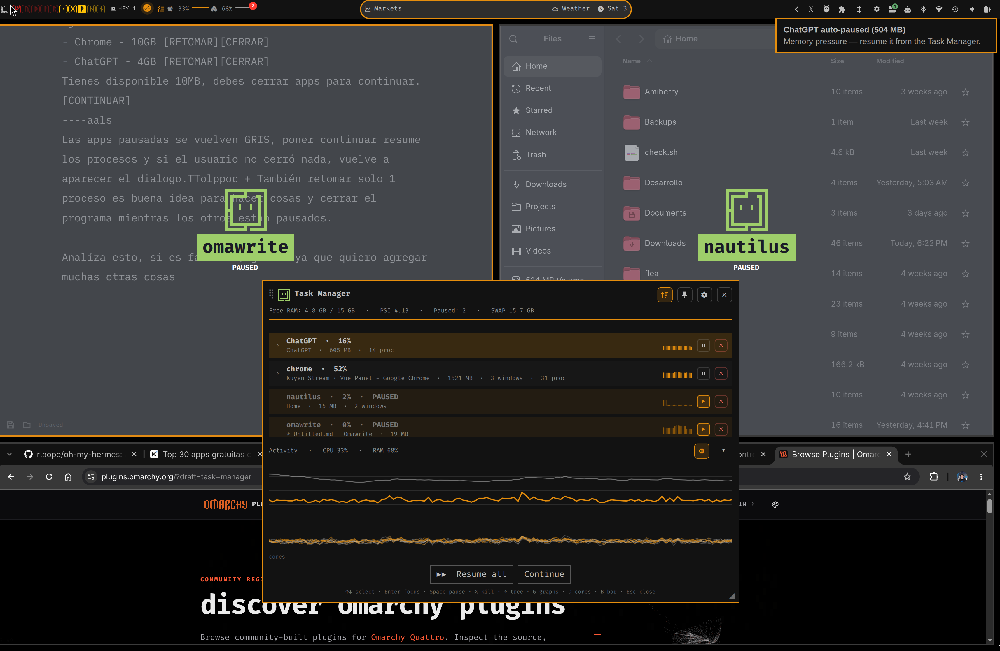

# Task Manager



Your Omarchy bar gains a kill switch for RAM hogs. When memory runs out,
apps freeze in place — greyed out, under the watchful eye of a blinking Omi —
while the kernel squeezes their idle pages into compressed RAM. Click, and
they come back like nothing happened.

## The fun parts

- **Pause any app, right on its window.** One click (or `Space`) freezes a
  whole app family: grey veil, blinking mascot, the app's name in big
  letters on a green badge. CPU drops to zero on the spot.
- **It watches while you don't.** A tiny Rust daemon (~500 KB) reads memory
  pressure every two seconds and auto-pauses the greediest apps before the
  desktop seizes up. You get a notification, not a lockup.
- **Frozen apps hand their RAM back.** While frozen, a temporary
  `memory.high` cap lets the kernel reclaim the app's cold pages — and with
  zswap on, they're compressed in RAM (~2-3x) instead of touching disk.
  That's the trick: paused apps stop costing you memory, not just CPU.
- **You set the limits.** Gear → max RAM% before the watchdog bites,
  optional CPU ceiling, bar display, sparklines. Sane defaults, your call.
- **Hunt single browser tabs.** Expand any app's process tree and pause or
  kill one renderer — that one tab eating 2 GB — while the rest of the
  browser never notices.
- **No fake "not responding" dialogs.** Hyprland's ANR popup is silenced
  exactly while a pause is ours, and restored the moment nothing is frozen.
- **Real numbers, live.** Bar pill (icon / numbers / numbers + graphs),
  per-row sparklines, full CPU/RAM history with per-core detail, and a
  System section showing what the daemons are up to.
- **Keyboard first.** `↑↓` select, `Enter` focus, `Space` pause, `X` kill,
  `→` tree, `G` graphs, `D` cores, `B` bar mode, `R` refresh, `Esc` close.
  A legend line at the bottom of the card lists them all.
- **Speaks your language.** EN, ES, PT, FR, DE, following your Omarchy
  locale.

## How the pause works (no root, no magic)

Omarchy apps run in systemd user scopes on cgroup v2. Freezing sets
`cgroup.freeze=1` (a SIGSTOP fallback covers strays), so a paused app burns
exactly 0 CPU. RAM reclaim is the kernel's own machinery — `memory.high`
plus zswap — and thaw restores everything in place. The session never asks
for sudo, and kill always thaws first (frozen processes can't handle
SIGTERM).

## Install

```sh
curl -fsSL https://raw.githubusercontent.com/avillagran/omarchy-task-manager/main/install.sh | bash
```

Uninstall just as cleanly — watchdog stopped, everything thawed, unit
removed, your config untouched:

```sh
curl -fsSL https://raw.githubusercontent.com/avillagran/omarchy-task-manager/main/install.sh | bash -s -- --uninstall
```

## Shortcut

Nothing touches your keybinds without asking. Open the card, hit the gear,
and flip **Show window shortcut** on: that's `SUPER+SHIFT+T`. Same switch
turns it off.

## Recommended: zswap (compressed RAM)

Without zswap, reclaimed pages go straight to disk. One-time enable:

```sh
sudo sh -c 'echo Y > /sys/module/zswap/parameters/enabled'
echo "w /sys/module/zswap/parameters/enabled - - - - Y" | sudo tee /etc/tmpfiles.d/zswap.conf
```

The card detects a missing zswap and shows these commands with a copy
button.

## Layout

    manifest.json
    BarWidget.qml                  bar pill + overlay card + veils
    i18n.json                      EN/ES/PT/FR/DE
    install.sh                     idempotent installer (--uninstall)
    systemd/omarchy-task-manager.service   watchdog unit template
    bin/task-manager-launch.sh     arch launcher
    bin/task-manager-keybind.sh    opt-in shortcut manager
    bin/task-manager-aarch64       prebuilt helper (ARM/Asahi)
    bin/task-manager-x86_64        prebuilt helper (Intel/AMD)
    bin/task-manager-rs/           Rust crate (cargo build --release)

## Resource cost (measured)

- Helper: ~5 ms per state call, ~500 KB binary. Watchdog: 2 reads/500 ms.
- Bar poll: 15 s idle, 2 s while the card is open or any app is paused.

## Credits

- **Omi**, the mascot blinking over your paused apps, was an idea by
  [@tahayvr](https://github.com/tahayvr). The vector path comes from the
  official Omarchy brand assets.

## Roadmap

- Marketplace submission.
